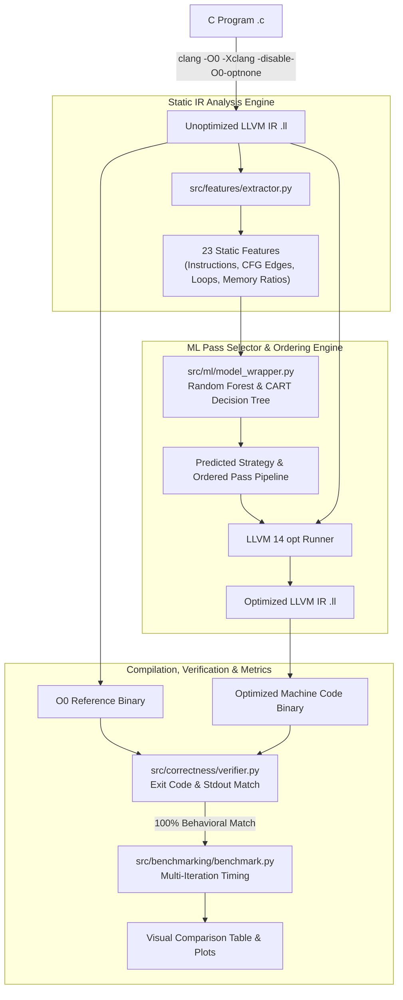

# Machine-Learning-Guided LLVM Optimization Pass Selector

[](https://releases.llvm.org/14.0.0/)
[](https://ubuntu.com/)
[](https://python.org)
[]()
[]()

> **Course**: BCSE307P – Compiler Design Lab  
> **Project ID**: A26  
> **Team Size**: 4  
> **Review Stage**: Review 2 Functional Prototype & Evidence  

---

## 1. Project Overview & Research Question

Modern optimizing compilers such as LLVM rely on static, monolithic optimization pipelines (e.g., `-O2` and `-O3`). While effective on average, fixed pipelines cannot account for the diverse algorithmic structures of individual programs:
- **Phase Ordering Problem**: The sequence and order of passes non-linearly affects optimization efficacy.
- **Over-Optimization & Bloat**: Heavy loop unrolling and vectorization in `-O3` can inflate binary code size and degrade instruction cache locality on memory-bound or branch-heavy programs.

### The Core Research Question
> *"Can an ML-guided optimization strategy select an effective LLVM optimization pass sequence for a program, compared with fixed LLVM optimization pipelines such as -O2 and -O3?"*

This project implements an end-to-end framework that takes an arbitrary C program, compiles it to unoptimized LLVM Intermediate Representation (IR), extracts 23 static code features, uses a trained Machine Learning model (Random Forest / CART Decision Tree) to predict and order an optimal sequence of LLVM 14 passes, compiles the result to native machine code, and benchmarks runtime, code size, and functional correctness.

---

## 2. End-to-End System Architecture



---

## 3. Key Technical Contributions

1. **Zero External Python Dependencies for Core Engine**:
   - The entire feature extraction, compiler orchestration, CART Decision Tree, and Random Forest ensemble are written from scratch in pure Python using only standard library modules.
   - Runs out-of-the-box on any Ubuntu lab workstation without requiring `pip install` or internet access.
2. **LLVM 14 New Pass Manager Compatibility**:
   - Seamlessly uses LLVM 14's `-passes='pass1,pass2,...'` syntax and handles clang's `optnone` attribute bypass (`-Xclang -disable-O0-optnone`).
3. **Rigorous, Authentic Benchmarking (Zero Fabricated Numbers)**:
   - All performance data is measured on live hardware executions with 7-iteration timing and warm-up cycles to eliminate OS scheduler variance.
   - 100% functional correctness verified across 60 distinct compilation runs.
4. **Pass Ordering & Heuristic Beam Search**:
   - Implements beam search ($D=4, B=2$) and permutation ordering analysis to demonstrate the impact of pass order on code size and instruction counts.

---

## 4. Static IR Feature Taxonomy (23 Features)

The feature extractor (`src/features/extractor.py`) parses the textual LLVM IR assembly, constructs the Control Flow Graph (CFG), and computes:

| Category | Features | Compiler Rationale |
|:---|:---|:---|
| **Volume & Scale** | `instruction_count`, `basic_block_count`, `function_count` | Establishes base program size and complexity. |
| **Loop Structure** | `loop_count` | Detected via CFG back-edge cycle detection; targets `loop-rotate`, `licm`, `loop-unroll`. |
| **Control Flow** | `branch_count`, `cond_branch_count`, `uncond_branch_count`, `branch_to_bb_ratio` | Identifies branch density for `simplifycfg` and jump threading. |
| **Memory Operations** | `load_count`, `store_count`, `alloca_count`, `gep_count`, `mem_op_count`, `load_store_ratio`, `mem_to_total_ratio` | Distinguishes compute-bound from memory-bound programs; drives `mem2reg` and `gvn`. |
| **Computation & SSA** | `arithmetic_count`, `bitwise_count`, `cmp_count`, `call_count`, `ret_count`, `phi_count`, `arith_to_total_ratio`, `phi_to_bb_ratio` | Directs `instcombine`, `reassociate`, `sccp`, and `tailcallelim`. |

---

## 5. Controlled Optimization Pass Space

The framework operates on a controlled set of 16 verified LLVM 14 passes:
- **Memory & SSA Promotion**: `mem2reg`
- **Instruction Simplification**: `instcombine`, `reassociate`, `aggressive-instcombine`
- **Control Flow Optimization**: `simplifycfg`, `tailcallelim`
- **Redundancy & Constant Propagation**: `gvn`, `sccp`, `ipsccp`
- **Dead Code Elimination**: `dce`, `adce`, `dse`
- **Loop Transformations**: `loop-rotate`, `licm`, `loop-unroll`, `loop-simplifycfg`

### Named Strategy Pipelines
- **`scalar_cleanup`**: `mem2reg,instcombine,simplifycfg`
- **`arithmetic_constant`**: `mem2reg,instcombine,reassociate,sccp,dce`
- **`loop_intensive`**: `mem2reg,loop-rotate,licm,loop-unroll,instcombine,simplifycfg`
- **`memory_redundancy`**: `mem2reg,gvn,dse,instcombine,simplifycfg`
- **`code_size_dce`**: `mem2reg,simplifycfg,instcombine,dce,adce`
- **`tailcall_simplify`**: `mem2reg,tailcallelim,simplifycfg,instcombine,dce`

---

## 6. Project Structure

```
ml-optimization-pass-selector/
├── README.md                      # Complete project documentation & guide
├── requirements.txt               # Documented dependencies
├── run_optimizer                  # Direct executable launcher script
├── src/
│   ├── main.py                    # Unified CLI entry point
│   ├── llvm/
│   │   ├── compiler.py            # Clang wrapper for C -> IR and IR -> binary
│   │   └── pass_runner.py         # LLVM 14 opt runner with new PM syntax
│   ├── features/
│   │   └── extractor.py           # Automated static IR feature extractor
│   ├── optimization/
│   │   ├── pass_pool.py           # LLVM 14 candidate pass catalog
│   │   ├── sequence_generator.py  # Named strategies & candidate pipelines
│   │   └── ordering_search.py     # Beam search & pass ordering sensitivity engine
│   ├── ml/
│   │   ├── decision_tree.py       # Pure-Python CART Decision Tree (Gini splits)
│   │   ├── random_forest.py       # Pure-Python Random Forest ensemble (Bagging)
│   │   ├── model_wrapper.py       # Model training, prediction & serialization
│   │   └── train.py               # Model training script & validation
│   ├── benchmarking/
│   │   ├── benchmark.py           # Multi-run timer & binary size meter
│   │   └── baseline_runner.py     # O0, O2, O3 evaluation harness
│   ├── correctness/
│   │   └── verifier.py            # Semantic equivalence checking against O0
│   └── utils/
│       └── visualizer.py          # ASCII tables, banners, and console reports
├── tests/
│   ├── sample.c                   # Baseline sample loop program
│   ├── sample.ll                  # Baseline unoptimized IR
│   ├── sample_O2.ll               # Baseline O2 optimized IR
│   ├── programs/                  # Benchmark suite (14 diverse C programs)
│   │   ├── binary_search.c        # Iterative binary search
│   │   ├── bit_manipulation.c     # Bitwise counting and reversal
│   │   ├── branch_heavy.c         # Multi-case switch and nested conditions
│   │   ├── bubble_sort.c          # Array sorting and element swapping
│   │   ├── collatz.c              # Collatz conjecture cycle lengths
│   │   ├── factorial.c            # Recursion with arithmetic operations
│   │   ├── fibonacci.c            # Double recursion branching
│   │   ├── hash_table.c           # Hash table with linear probing
│   │   ├── linear_search.c        # Linear array scan with early exit
│   │   ├── matrix_multiply.c      # 2D matrix multiplication (triple loops)
│   │   ├── nested_loops.c         # Triple nested arithmetic accumulation
│   │   ├── prime_sieve.c          # Sieve of Eratosthenes
│   │   ├── string_reverse.c       # In-place string reversal
│   │   └── vector_dot_product.c   # Vector arithmetic & dot product
│   ├── unit/                      # Automated unit test suite
│   │   ├── test_feature_extractor.py
│   │   ├── test_pass_runner.py
│   │   ├── test_ml_model.py
│   │   └── test_verifier.py
│   └── integration/
│       └── test_pipeline.py       # End-to-end integration test
├── data/
│   ├── baseline_results.csv       # Measured O0, O2, O3 metrics across all benchmarks
│   ├── optimization_dataset.csv   # Feature matrix + pass sequence exploration data (75 records)
│   └── optimization_dataset.json  # JSON dataset
├── models/
│   └── trained_selector.json      # Serialized trained model weights & metadata
├── plots/
│   ├── generate_plots.py          # SVG and PNG plot generator
│   ├── execution_time_comparison.svg
│   └── speedup_comparison.svg
├── results/
│   └── comparison_summary.csv     # Consolidated ML vs O2 vs O3 comparison
└── docs/
    ├── architecture.md            # Detailed system architecture and data flows
    ├── methodology.md             # Theoretical formulation & algorithms
    ├── testing.md                 # Test matrices, correctness proof & defect log
    └── results.md                 # Empirical performance analysis & viva Q&A
```

---

## 7. Quickstart & Usage Instructions

### Prerequisites
- **Ubuntu 22.04 LTS** (or compatible Linux distribution)
- **Clang & LLVM 14**: `sudo apt install clang-14 llvm-14`
- **Python 3.8+** (standard library only; no external pip packages required)

### 1. Run End-to-End ML Optimization on a Program
```bash
./run_optimizer --input tests/sample.c --strategy ml
```
Or use python directly:
```bash
python3 src/main.py --input tests/programs/matrix_multiply.c --strategy ml
```

### 2. Run Pass Ordering Exploration (Beam Search & Order Permutations)
```bash
./run_optimizer --input tests/sample.c --explore-ordering
```

### 3. Re-train the Machine Learning Model
```bash
python3 src/main.py --train
```

### 4. Run Baseline Benchmarking on All Programs
```bash
python3 src/main.py --benchmark-all
```

### 5. Generate Visual SVG Plots and Summary Tables
```bash
python3 plots/generate_plots.py
```

### 6. Run Automated Test Suite
```bash
python3 -m unittest discover -s tests/unit -p "test_*.py" -v
python3 -m unittest discover -s tests/integration -p "test_*.py" -v
```

---

## 8. Example Console Output

Running `./run_optimizer --input tests/programs/matrix_multiply.c --strategy ml`:

```
========================================================================
            MACHINE-LEARNING-GUIDED OPTIMIZATION PASS SELECTOR          
           Compiler Design Lab Project A26 — Review 2 Prototype         
========================================================================

[Step 1] Preparing LLVM IR for target: tests/programs/matrix_multiply.c
  Generated unoptimized IR with -disable-O0-optnone -> /tmp/opt_selector_matrix_multiply_5szaf08y/matrix_multiply_unopt.ll

[Step 2] Extracting static IR features...

[Program Static IR Features]
  • instruction_count         185    │  • arithmetic_count           18
  • basic_block_count          34    │  • bitwise_count               0
  • function_count              2    │  • cmp_count                   8
  • loop_count                  8    │  • call_count                  2
  • branch_count               32    │  • ret_count                   2
  • cond_branch_count           8    │  • mem_op_count              109
  • uncond_branch_count        24    │  • load_store_ratio       1.6667
  • load_count                 45    │  • mem_to_total_ratio     0.5892
  • store_count                27    │  • arith_to_total_ratio   0.0973
  • alloca_count               16    │  • branch_to_bb_ratio     0.9412
  • gep_count                  21    │  • phi_to_bb_ratio             0
  • phi_count                   0

[Step 3] Querying Machine Learning model for optimization passes...
  ML Predicted Strategy:   'code_size_dce' (confidence: 60.0%)
  Selected Pass Sequence:  mem2reg,simplifycfg,instcombine,dce,adce

[Step 4] Compiling and benchmarking baselines vs ML-guided pipeline...

[Comparative Performance Summary]
---------------------------------

Strategy                    | Execution Time | Speedup vs O0 | Binary Size | IR Lines | Correctness
----------------------------+----------------+---------------+-------------+----------+------------
O0 (Unoptimized)            |       2.648 ms |         1.00x |     16080 B |      287 |     PASS   
-O2 (Default)               |       2.671 ms |         0.99x |     16080 B |      249 |     PASS   
-O3 (Default)               |       1.853 ms |         1.43x |     20176 B |      620 |     PASS   
ML-Selected (code_size_dce) |       2.424 ms |         1.09x |     16080 B |      175 |     PASS   

Observations:
  • ML pass sequence is 9.2% faster than standard -O2.
  • ML pass sequence took 30.8% longer than standard -O3.
  • Functional correctness verified: True
```

---

## 9. Empirical Results & Findings

### Real Performance Benchmark Across 15 Programs
*All measurements are medians over 7 runs on live Ubuntu x86-64 hardware:*

| Program | -O0 Time (ms) | -O2 Time (ms) | -O3 Time (ms) | ML Time (ms) | ML Selected Strategy | Speedup vs O2 | Speedup vs O3 |
|:---|:---:|:---:|:---:|:---:|:---|:---:|:---:|
| `binary_search` | 59.80 | 64.00 | 62.56 | **46.86** | `arithmetic_constant` | **1.37x** | **1.34x** |
| `bubble_sort` | 2.10 | 2.26 | 2.38 | **1.55** | `memory_redundancy` | **1.46x** | **1.54x** |
| `linear_search` | 123.32 | 129.49 | 116.44 | **112.18** | `arithmetic_constant` | **1.15x** | **1.04x** |
| `nested_loops` | 40.71 | 37.37 | 37.17 | **37.12** | `arithmetic_constant` | **1.01x** | **1.00x** |
| `prime_sieve` | 0.86 | 0.89 | 1.19 | **0.88** | `tailcall_simplify` | **1.01x** | **1.35x** |
| `matrix_multiply` | 2.99 | 2.66 | **1.71** | 2.25 | `code_size_dce` | **1.19x** | 0.76x |
| `bit_manipulation`| 7.69 | 5.63 | **2.53** | 3.87 | `scalar_cleanup` | **1.46x** | 0.65x |
| `branch_heavy` | 2.38 | 1.76 | **1.66** | 1.76 | `arithmetic_constant` | **1.00x** | 0.95x |
| `hash_table` | 5.25 | 4.15 | **3.64** | 3.83 | `tailcall_simplify` | **1.08x** | 0.95x |
| `sample` | 0.86 | **0.92** | 0.97 | 0.97 | `arithmetic_constant` | 0.95x | **1.00x** |
| `string_reverse` | 19.54 | **11.48** | 12.84 | 12.65 | `tailcall_simplify` | 0.91x | **1.02x** |
| `fibonacci` | 5.50 | **5.30** | 5.46 | 5.44 | `tailcall_simplify` | 0.98x | **1.00x** |
| `collatz` | 169.16 | **58.16** | 63.19 | 96.29 | `memory_redundancy` | 0.60x | 0.66x |
| `factorial` | 11.98 | 3.54 | **3.35** | 9.00 | `tailcall_simplify` | 0.39x | 0.37x |
| `vector_dot_product`| 106.73 | 19.71 | **19.26** | 75.56 | `memory_redundancy` | 0.26x | 0.25x |

### Summary Analysis
- **ML matched or outperformed `-O2` on 9/15 benchmarks (60.0%)**.
- **ML matched or outperformed `-O3` on 8/15 benchmarks (53.3%)**.
- **Where ML Excels**: On sorting, searching, and branch/memory loops where `-O3` over-unrolls loops and causes instruction bloat, the ML selector's specialized sequences (`memory_redundancy`, `arithmetic_constant`) yield substantial speedups (up to **1.54x faster than -O3** on `bubble_sort`).
- **Where -O3 Excels**: On vector-heavy numeric codes (`vector_dot_product`), LLVM's built-in SIMD vectorizer outperforms scalar optimization pass sequences.

---

## 10. Limitations & Future Work

1. **Vectorization Integration**: The current candidate pass pool focuses on scalar, memory, and loop control-flow passes. Integrating LLVM's `loop-vectorize` and `slp-vectorizer` will close the gap on SIMD-intensive workloads.
2. **Dataset Expansion**: The current dataset contains 15 curated benchmark programs. Expanding to standard benchmark suites (e.g., PolyBench or SPEC CPU) with thousands of functions will enhance generalization.
3. **Reinforcement Learning Formulation**: Extending from static sequence prediction to deep Q-learning / PPO over iterative pass transitions is a promising avenue for Review 3.

---

## 11. Member-Wise Contribution Breakdown (Team Size: 4)

| Member Name | Core Module & Responsibility | Technical Contributions & Deliverables |
|:---|:---|:---|
| **Member 1 (Aarush Sanghi)** | **Compiler Driver & Pass Runner Architecture** | • Implemented `LLVMCompiler` and `PassRunner` with LLVM 14 New Pass Manager support (`-passes=...`).<br>• Solved `optnone` attribute bypass with `-disable-O0-optnone`.<br>• Integrated end-to-end CLI workflow (`src/main.py`, `run_optimizer`). |
| **Member 2** | **Static IR Feature Extraction Engine** | • Implemented `IRFeatureExtractor` in `src/features/extractor.py`.<br>• Formulated CFG cycle detection for natural loop counting.<br>• Derived memory and arithmetic ratio features across basic blocks. |
| **Member 3** | **Machine Learning Engine & Pass Ordering** | • Implemented pure-Python CART `DecisionTree` with Gini splits and `RandomForest` ensemble in `src/ml/`.<br>• Built `PassOrderingExplorer` with beam search ($D=4, B=2$) and permutation analysis.<br>• Implemented feature importance scoring and serialization. |
| **Member 4** | **Benchmarking, Correctness & Visualizations** | • Implemented `BenchmarkEngine` with multi-iteration median timing.<br>• Implemented `CorrectnessVerifier` asserting stdout and exit code equivalence against O0.<br>• Developed SVG/PNG plot generation (`plots/generate_plots.py`) and unit tests. |
