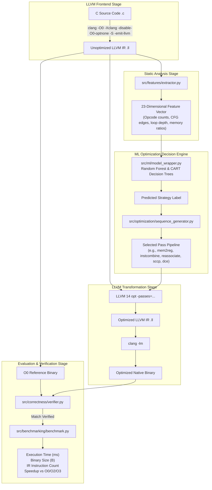

# System Architecture & Technical Specifications

**Course**: BCSE307P – Compiler Design Lab  
**Project ID**: A26  
**Project Title**: Machine-Learning-Guided Optimization Pass Selector  
**Target Environment**: Ubuntu 22.04 LTS | LLVM / Clang 14.0.0 | Python 3.10  

---

## 1. High-Level Architecture

The framework replaces static, monolithic compiler optimization pipelines (such as `-O2` and `-O3`) with an intelligent, data-driven optimization selector that tailors pass selection and ordering to the structural characteristics of intermediate code.



---

## 2. Component Specifications

### 2.1 Compiler & Pass Engine (`src/llvm/`)
- **`compiler.py` (`LLVMCompiler`)**:
  - Handles invoking `clang` with `-O0 -Xclang -disable-O0-optnone -S -emit-llvm` to produce intermediate representation that is not locked by `optnone` attributes.
  - Compiles intermediate `.ll` files directly to ELF x86-64 executables with `-lm`.
- **`pass_runner.py` (`PassRunner`)**:
  - Interacts with LLVM 14 `opt`.
  - Configures the **New Pass Manager** syntax: `-passes='pass1,pass2,...'` and default pipelines `default<O0>`, `default<O2>`, `default<O3>`.

### 2.2 Static IR Feature Extractor (`src/features/extractor.py`)
- Automatically parses the textual LLVM IR assembly without requiring LLVM C++ library bindings.
- Tracks Control Flow Graphs (CFG) per function to compute natural loop counts using cycle back-edge detection (`u -> v` where topological index of `v <= u`).
- Extracts 23 static program features categorized into:
  - **Magnitude features**: `instruction_count`, `basic_block_count`, `function_count`, `loop_count`.
  - **Instruction distributions**: `load_count`, `store_count`, `alloca_count`, `gep_count`, `phi_count`, `arithmetic_count`, `bitwise_count`, `cmp_count`, `call_count`, `ret_count`.
  - **Control flow**: `branch_count`, `cond_branch_count`, `uncond_branch_count`.
  - **Structural ratios**: `load_store_ratio`, `mem_to_total_ratio`, `arith_to_total_ratio`, `branch_to_bb_ratio`, `phi_to_bb_ratio`.

### 2.3 Pass Pool & Sequence Exploration (`src/optimization/`)
- **`pass_pool.py`**: Declares 16 verified LLVM 14 passes across scalar cleanup, loop transforms, redundancy elimination, and control flow.
- **`sequence_generator.py`**: Manages coherent strategies:
  - `scalar_cleanup`: `mem2reg,instcombine,simplifycfg`
  - `arithmetic_constant`: `mem2reg,instcombine,reassociate,sccp,dce`
  - `loop_intensive`: `mem2reg,loop-rotate,licm,loop-unroll,instcombine,simplifycfg`
  - `memory_redundancy`: `mem2reg,gvn,dse,instcombine,simplifycfg`
  - `code_size_dce`: `mem2reg,simplifycfg,instcombine,dce,adce`
  - `tailcall_simplify`: `mem2reg,tailcallelim,simplifycfg,instcombine,dce`
- **`ordering_search.py` (`PassOrderingExplorer`)**:
  - Implements Beam Search (Depth $D=4$, Beam Width $B=2$) over the pass pool.
  - Implements permutation ordering sensitivity analysis to measure instruction reduction under different pass orders.

### 2.4 Machine Learning Engine (`src/ml/`)
- **Zero External Dependencies**: Implemented from scratch in pure Python standard library for maximum portability and viva inspectability.
- **`decision_tree.py` (`DecisionTree`)**:
  - Full CART implementation.
  - Gini Impurity for classification: $I_G(p) = 1 - \sum_{i=1}^J p_i^2$.
  - Midpoint threshold scanning across all continuous feature dimensions.
  - Recursive tree construction and ASCII tree rendering for viva examinations.
- **`random_forest.py` (`RandomForest`)**:
  - Bootstrap aggregation (Bagging) of $M=25$ trees.
  - Random feature subspace selection ($k = \sqrt{F}$).
  - Out-of-bag voting and aggregated feature importance weights.
- **`model_wrapper.py` (`PassSelectorModel`)**:
  - Unified interface with persistence (`save` / `load` to JSON).

### 2.5 Benchmarking & Correctness (`src/benchmarking/`, `src/correctness/`)
- **`benchmark.py` (`BenchmarkEngine`)**:
  - High-precision wall-clock timing using `time.perf_counter_ns()`.
  - Warm-up execution + 7 measurement iterations.
  - Computes median, mean, min, and standard deviation to filter out OS scheduler jitter.
  - Exact byte count accounting for generated binary executables.
- **`verifier.py` (`CorrectnessVerifier`)**:
  - Runs reference `-O0` binary and optimized test binary.
  - Asserts exact equality of exit code and standard output. Flags any divergence as `FAIL`.

---

## 3. Data Flow & Artifact Storage

```
data/
├── baseline_results.csv       # O0, O2, O3 metrics across all benchmark programs
├── optimization_dataset.csv   # Feature matrix + pass sequence exploration data (75 records)
└── optimization_dataset.json  # Structured JSON dataset

models/
└── trained_selector.json      # Serialized trained model weights, thresholds, and metadata

results/
└── comparison_summary.csv     # Detailed performance comparison (ML vs O2 vs O3)

plots/
├── execution_time_comparison.svg  # Grouped execution time visualization
└── speedup_comparison.svg         # Speedup distribution chart
```
